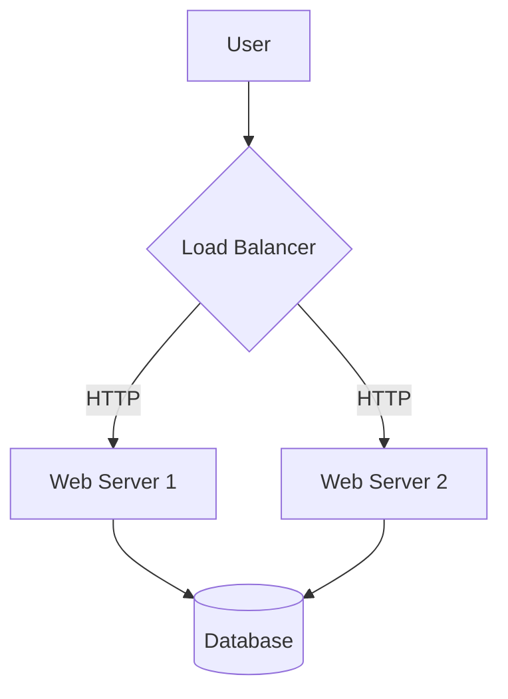
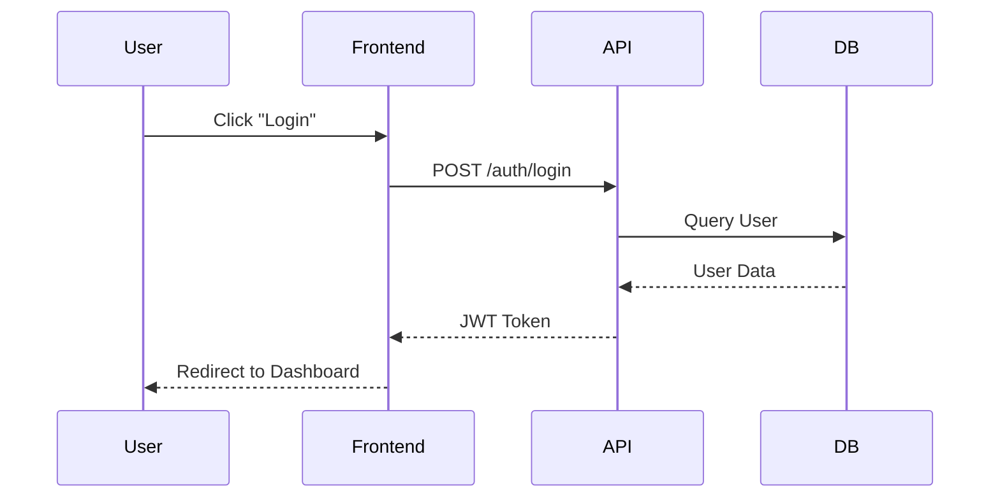
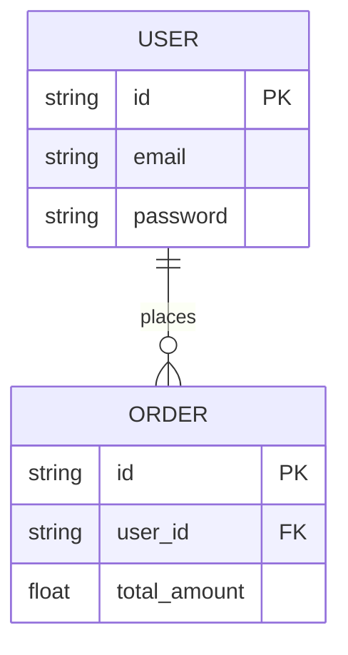
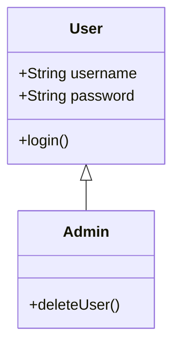

# Mermaid Diagram Guide

This reference provides patterns and tips for generating high-quality Mermaid diagrams for system architecture.

## 1. Flowcharts (Graph)
Used for process flows, decision trees, and high-level component connections.

## 2. Sequence Diagrams
Best for showing interactions between components over time.

## 3. Entity Relationship Diagrams (ERD)
Used for database schema design.

## 4. Class Diagrams
Good for detailed object-oriented design.

## Tips for Better Diagrams
- **Labels**: Use clear, descriptive labels for nodes and edges.
- **Direction**: Use `TD` (Top-Down) for hierarchies and `LR` (Left-Right) for processes.
- **Subgraphs**: Use `subgraph` to group related components (e.g., "Frontend", "Backend", "Storage").
- **Styling**: Keep it simple. Focus on structure over aesthetics.
