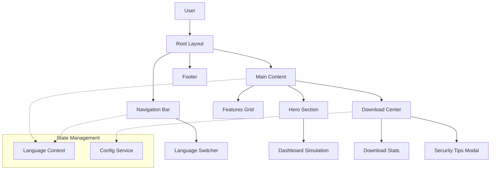
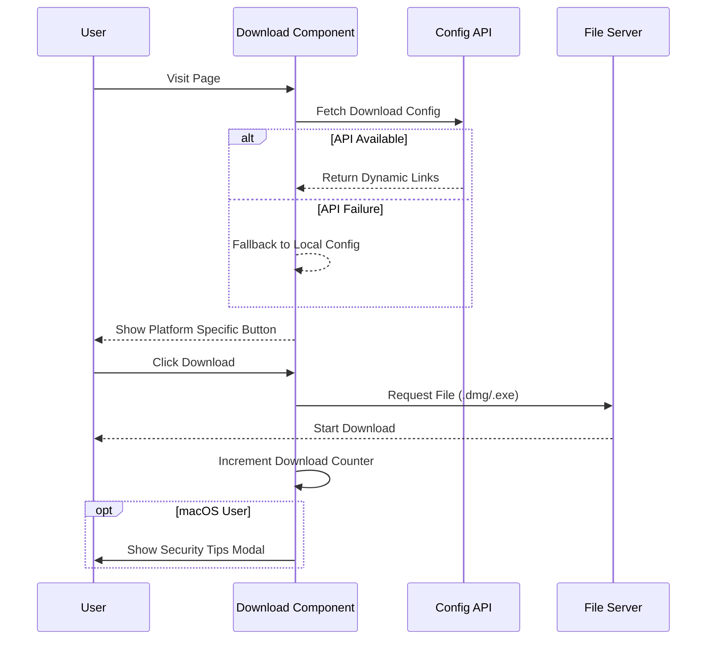

# System Architecture Document: Aiden Landing Page

## 1. Executive Summary
Aiden Landing Page 是 Aiden 智能监控引擎的官方展示与分发门户。该系统旨在通过现代化的 Web 界面向用户展示 Aiden 的核心能力（实时监控、成本分析、推理可视化），并提供多平台客户端（macOS/Windows）的高效下载服务。系统采用高性能的 Next.js 框架构建，以此确保在全球范围内的快速访问和优秀的用户体验。

## 2. Requirements Analysis

### 2.1 Functional Requirements
- **多语言支持**: 基于 React Context 实现的中英切换，自动检测浏览器语言。
- **产品展示**: 通过交互式仪表盘模拟（Token 用量、延迟、稳定性）展示产品核心价值。
- **下载管理**: 智能识别用户操作系统，提供对应的客户端下载链接（.dmg/.exe），并集成下载统计功能。
- **用户引导**: 针对 macOS 用户提供安全设置引导（Gatekeeper 绕过指令）。
- **社交分享**: 调用原生分享 API 或剪贴板复制功能。

### 2.2 Non-Functional Requirements
- **性能**: 首屏加载时间 (FCP) < 1.5s，交互延迟 (INP) < 200ms。
- **响应式设计**: 完美适配移动端、平板及桌面端（断点：Mobile, Tablet, Desktop）。
- **视觉风格**: 统一的 Dark Mode 设计语言，采用玻璃拟态与渐变色风格。
- **可维护性**: 组件化架构，配置与逻辑分离。

## 3. System Components

系统主要由以下模块组成：

### 3.1 Core UI Components
- **Navbar**: 包含品牌标识、导航锚点及语言切换器。
- **Hero Section**: 版本展示、核心 Slogan 及产品模拟器。
- **Features Grid**: 响应式网格展示四大核心功能（Activity, Charts, TTFT, Layers）。
- **Download Center**: 平台检测、下载链接动态获取及安全提示弹窗。

### 3.2 State Management
- **LanguageContext**: 全局管理当前语言状态 (`en`/`zh`) 及翻译字典。
- **DownloadConfig**: 优先从 API 获取下载配置，失败时降级使用本地静态配置。

### 3.3 Utilities
- **i18n hook**: 提供 `t()` 函数进行文本替换。
- **Tailwind Config**: 定制颜色、字体及动画效果。

## 4. Architectural Diagrams

### 4.1 High-Level Component Architecture

### 4.2 Download Flow Sequence

## 5. Technology Stack

- **Framework**: Next.js 16.1.4 (App Router) - 利用服务端渲染 (SSR) 提升 SEO 和首屏性能。
- **Frontend Library**: React 19.2.3 - 构建声明式 UI。
- **Styling**: Tailwind CSS v4 - 原子化 CSS 方案，配合 `clsx` 和 `tailwind-merge` 管理动态样式。
- **Icons**: Lucide React - 轻量级 SVG 图标库。
- **Visualization**: Recharts - 用于 Hero 区域的模拟图表展示。
- **Deployment**: Vercel - 提供全球 CDN 加速和无服务器函数支持。

## 6. Implementation Plan

### Phase 1: Foundation & UI
- 初始化 Next.js 16 项目结构。
- 配置 Tailwind v4 及全局样式变量。
- 实现基础布局 (Navbar, Footer) 和 Hero 区域静态展示。

### Phase 2: Core Features
- 开发 Features Grid 响应式布局。
- 实现 Download Center 及其配置回退逻辑。
- 集成模拟图表组件。

### Phase 3: Logic & Optimization
- 实现 `LanguageContext` 及全站国际化适配。
- 添加下载安全提示弹窗逻辑。
- 性能调优（字体优化、图片懒加载）。
- 部署至 Vercel 并配置自定义域名。

## 7. Risks and Mitigations

| Risk | Impact | Mitigation |
|------|--------|------------|
| **下载链接失效** | 用户无法获取软件 | 实现本地配置降级机制 (Fallback)，并定期自动化检测链接有效性。 |
| **浏览器兼容性** | 旧版浏览器样式错乱 | 使用 Tailwind CSS 的 Autoprefixer，并在构建流程中加入兼容性检查；主打现代浏览器支持。 |
| **macOS 安全拦截** | 用户无法安装软件 | 在下载后立即弹出明确的引导视窗，提供一键复制修复命令的功能。 |
